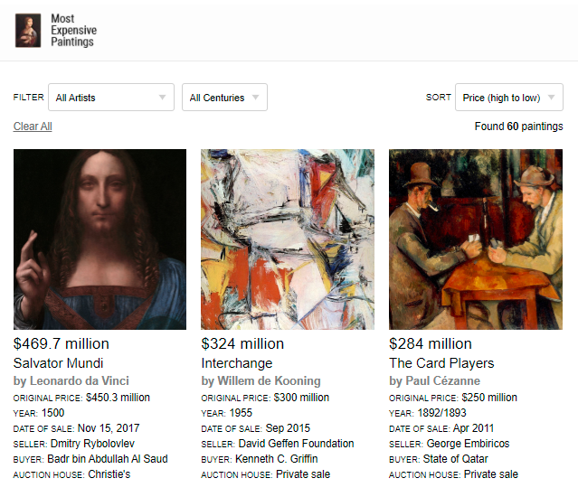

# MEPs - Most Expensive Paintings

This is a sample demo project exhibiting various interesting features of what's possible using Elixir, Erlang, OTP and the Phoenix framework with liveview support and web sockets.

The demo showcases worlds most expensive paintings and artwork.
 
## Requirements

- Elixir 
- Phoenix
- PostgreSQL

## Installation

Download and run `mix phx.server`

## Reference

The data is from the Wikipedia article here:
https://en.wikipedia.org/wiki/List_of_most_expensive_paintings
